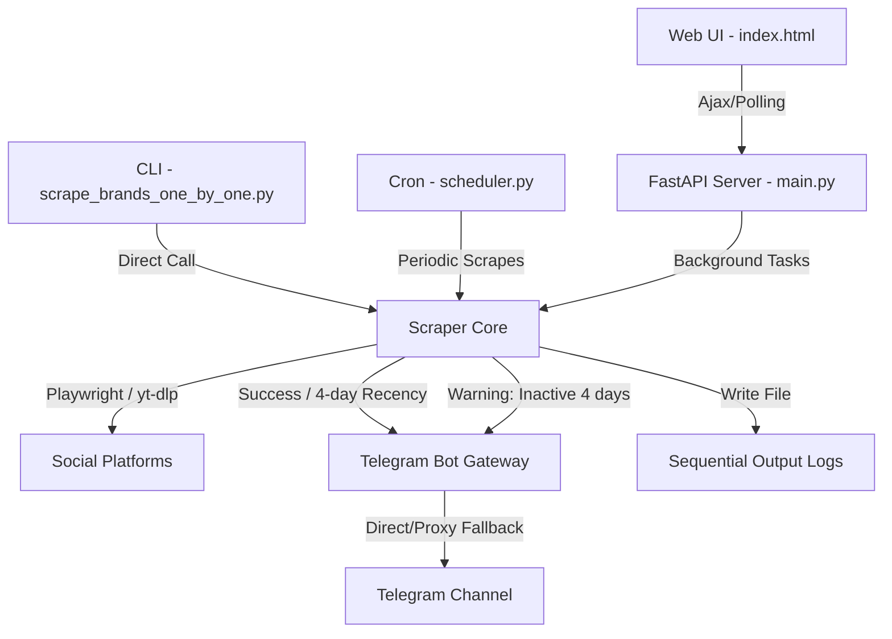

# 🗃️ ZDCURLCollector — Codebase Structure & Clone Guide

This document acts as a complete structural audit and step-by-step guide to clone and recreate this exact project from scratch. It contains the directory layout, descriptions of all files and their roles, internal data flows, and setup instructions.

---

## 🏛️ Architecture Design Overview

The project is structured around a **FastAPI backend** and a **Playwright-based scraper core**, controlled either via a **Dark Glassmorphic Web UI** or a background **Telegram bot scraper loop / CLI runner**.



### Core Architecture Components
1. **FastAPI Web App (`app/main.py`)**: Mounts static frontend files, exposes endpoints for manual scans or file uploads, runs CPU/Network-bound scraper operations inside async background tasks to prevent gateway timeouts (Cloudflare 524), and tracks jobs using an in-memory run status store.
2. **Platform Scrapers (`app/scrapers/`)**: Single-responsibility scraping modules:
   - Playwright-based (Chrome headless): **Instagram, Facebook, LinkedIn, Pinterest**.
   - API/Native wrapper: **YouTube** (via `yt-dlp`).
3. **Telegram Forwarder Gateway (`app/telegram_bot/bot.py` & `dedup.py`)**: Compiles scraped posts, strips duplicate entries permanently utilizing a JSON file-backed deduplication tracker (`data/sent_posts.json`), groups platforms under unified brand headers, and attempts direct transmission with automated failover through verified SOCKS5/HTTP proxies if direct connections timeout.
4. **Report Generator (`app/telegram_bot/ui_api.py`)**: Automatically logs scraped status and post URLs into sequential log files in the `output/` directory, naming them sequentially by date (e.g. `18junemanual1.txt`, `18junefile1.txt`).

---

## 📂 Directory Tree

Here is the exact file tree required to recreate the project:

```text
ZDCURLCollector/
├── .env                  # Environment configurations (tokens, channels, proxies)
├── Dockerfile            # Container definition for deploy on Linux VPS
├── requirements.txt      # Python dependencies manifest
├── run.py                # Launcher script for FastAPI
├── run_telegram_bot.py   # Launcher script for the Telegram cron scheduler
├── scrape_brands_one_by_one.py # CLI brand-by-brand runner (reads links.txt)
├── links.txt             # Default text file containing brand URLs
├── app/
│   ├── __init__.py       # Package marker
│   ├── main.py           # FastAPI application entrypoint
│   ├── models/
│   │   ├── __init__.py
│   │   └── schemas.py    # Pydantic input/output validation models
│   ├── scrapers/
│   │   ├── __init__.py
│   │   ├── facebook.py   # Playwright FB profile posts scraper
│   │   ├── instagram.py  # Playwright IG feed posts scraper
│   │   ├── linkedin.py   # Playwright LinkedIn company page scraper
│   │   ├── pinterest.py  # Playwright Pinterest board scraper
│   │   ├── playwright_base.py # Base class managing browser launch, viewport, & proxying
│   │   ├── router.py     # Dispatches URLs to the correct scraper module
│   │   └── youtube.py    # yt-dlp wrapper for YT channel uploads
│   ├── telegram_bot/
│   │   ├── __init__.py
│   │   ├── bot.py        # Telegram client, proxy failover, and message formatting
│   │   ├── dedup.py      # Permanent deduplication tracker class
│   │   ├── scheduler.py  # APScheduler periodic polling loop
│   │   └── ui_api.py     # Backend routers for the Web UI (bg tasks & Excel parser)
│   ├── tools/
│   │   ├── __init__.py
│   │   ├── check_sessions.py # Audits cookie session freshness
│   │   ├── detect_channel.py # Discovers the Telegram Channel ID
│   │   ├── import_cookies.py # Utility to sync raw browser cookie exports
│   │   └── login_helper.py   # Interactive GUI-based browser logging tool
│   └── utils/
│       ├── __init__.py
│       ├── date_parser.py    # Standardizes relative strings into YYYY-MM-DD
│       ├── platform_detector.py # Regex mapping URLs to platforms
│       ├── proxy_manager.py  # Rotates list of proxy addresses
│       ├── retry.py          # Tenacity decorator for scraping retry policies
│       └── session_manager.py# Manages saving/restoring JSON cookie states
├── config/
│   └── profiles.json     # Configuration file for background scheduler loop
├── data/
│   └── sent_posts.json   # JSON file database containing successfully sent post URLs
├── output/               # Storage folder for sequential text reports
│   └── .gitkeep
├── proxy/
│   ├── proxies_live1.txt      # Master list of proxy servers
│   └── working_tg_proxies.txt # List of verified working Telegram proxy nodes
├── sessions/             # Directory containing JSON cookie session files
│   ├── facebook_session.json
│   ├── instagram_session.json
│   └── linkedin_session.json
└── static/
    └── index.html        # Glassmorphic frontend dashboard (HTML, CSS, Vanilla JS)
```

---

## 📄 Core Codebase Modules Breakdown

### 1. The Core Scrapers (`app/scrapers/`)
*   **`playwright_base.py`**: A foundational class inheriting browser lifecycle control. Launching headless Chromium instances configured with flags (`--no-sandbox`, `--disable-dev-shm-usage`) and binding proxy configurations dynamically derived from the proxy list.
*   **`instagram.py`**: Navigates to target Instagram profile pages. Loads session cookies from `sessions/instagram_session.json` to bypass login barriers. Scrapes links, dates, and captions from profile feeds.
*   **`facebook.py`**: Bypasses cookie banners, loads Facebook credentials cookies, scroll-navigates targeted brand pages, extracts chronological updates, and specifically ignores pinned articles or profile header modifications.
*   **`linkedin.py`**: Connects via synced cookies, checks company posts panels, parses DOM nodes for feed content, and normalizes published timestamps.
*   **`pinterest.py`**: Resolves public board URLs (automatically normalizes international subdomains like `in.pinterest.com` or `za.pinterest.com`) and scrapes pin details. No authentication needed.
*   **`youtube.py`**: Uses `yt-dlp` to extract public video/shorts lists directly from channel URLs without needing browser logins.
*   **`router.py`**: The traffic dispatch controller. Identifies the platform and starts the corresponding sync/async scraping module.

### 2. Telegram Forwarder & Scheduler (`app/telegram_bot/`)
*   **`bot.py`**: Main message formatter. Formats post lines as: `📸 Instagram (Published: 2026-06-16): https://instagram.com/p/abc`. If a profile has not posted within 4 days, formats the warning line as: `📸 Instagram: ⚠️ Not posted from last 4 days`. Contains `_send_message_with_fallback` which tries direct delivery first and cycles through `proxy/working_tg_proxies.txt` on connection timeout.
*   **`dedup.py`**: Restores and updates `data/sent_posts.json` as a transaction-safe database to track sent posts and ensure duplicates are never forwarded.
*   **`scheduler.py`**: Periodically loops through `config/profiles.json` items, scans for updates, and forwards them individually to Telegram.
*   **`ui_api.py`**: Exposes FastAPI endpoints. Processes file uploads (TXT/XLSX), extracts brand categories, queues background scraping tasks, records progress in a thread-safe map, and saves sequential files in the `output/` folder.

### 3. Application Utilities (`app/utils/`)
*   **`date_parser.py`**: Resolves textual relative times (`"2h"`, `"3 days ago"`, `"Yesterday"`, `"June 14"`) into standardized date formats (`YYYY-MM-DD`). Provides `is_recent_post(date_str)` returning true if the post falls within the last 4 days.
*   **`platform_detector.py`**: Translates domain addresses to platform identifier strings.
*   **`proxy_manager.py`**: Cycles proxies from `proxy/proxies_live1.txt` for Playwright requests to prevent IP blocks.
*   **`session_manager.py`**: Serializes cookies into filesystem paths.

---

## 🛠️ Step-by-Step Replication Handbook

Follow these instructions to rebuild the project on a fresh environment (Windows or Linux).

### Step 1: Virtual Environment Setup
Ensure you have Python 3.11+ installed. Create and activate a virtual environment:

```bash
# Clone the repository structure or create a root folder ZDCURLCollector
mkdir ZDCURLCollector && cd ZDCURLCollector

# Create venv
python -m venv venv

# Activate (Linux/macOS)
source venv/bin/activate

# Activate (Windows CMD)
call venv\Scripts\activate.bat

# Activate (Windows PowerShell)
.\venv\Scripts\Activate.ps1
```

### Step 2: Install Dependencies & Playwright
Install the packages from `requirements.txt` and fetch the Playwright Chromium browser binary:

```bash
# Upgrade pip
python -m pip install --upgrade pip

# Install dependencies
pip install -r requirements.txt

# Install Chromium
playwright install chromium
```

### Step 3: Configure Environment Variables
Create a file named `.env` in the root folder and configure your credentials:

```ini
TELEGRAM_BOT_TOKEN=1234567890:ABCdefGHIjklMNOpqrsTUVwxyz
TELEGRAM_CHANNEL_ID=-1001234567890
SESSIONS_DIR=./sessions
DEBUG_SCREENSHOTS=false
```

### Step 4: Login to Social Media Platforms (Session Cookie Sync)
To scrape Facebook, Instagram, and LinkedIn, you must initialize active sessions. We do this by launching interactive browser sessions to let you log in, then saving the session cookies to the project directory.

Run the interactive login helper script:
```bash
# Log in to Instagram
python -m app.tools.login_helper instagram

# Log in to Facebook
python -m app.tools.login_helper facebook

# Log in to LinkedIn
python -m app.tools.login_helper linkedin
```
*A browser window will open. Enter your credentials, complete 2FA if prompted, and click log in. Once logged in, press Enter in the terminal to save the session file to `sessions/`.*

Check session health at any time:
```bash
python -m app.tools.check_sessions
```

### Step 5: Start the App

#### Option A: Running the Web UI & API Server
Start the Uvicorn server:
```bash
python run.py
```
Open your browser and navigate to `http://localhost:8000`. You will see the glassmorphic scraping control panel.

#### Option B: Running the Scheduled Background Bot
To start the background scheduler loop that checks profiles in `config/profiles.json` on a timer:
```bash
python run_telegram_bot.py
```

#### Option C: Running the CLI Scraper
To scrape brands and URLs defined in `links.txt` one-by-one immediately and output a report:
```bash
python scrape_brands_one_by_one.py
```
This CLI run automatically updates the deduplication list, logs messages to Telegram, and outputs a sequential text report under `output/`.
